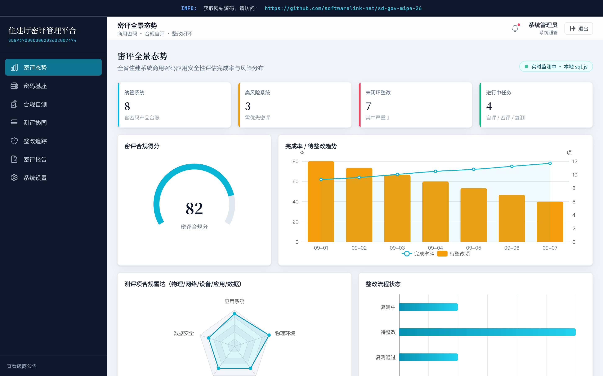

# SD Gov Mipe 26 - 山东省住建厅系统密评管理平台

**上线主域名**：https://sd-gov-mipe-26.softwarelink.net/
**项目仓库**：https://github.com/softwarelink-net/sd-gov-mipe-26



## 招标公告全文
- **标题**：山东省住房和城乡建设厅2026年度系统密评项目竞争性磋商公告
- **项目发包方**：山东省住房和城乡建设厅
- **项目编号**：SDGP370000000202602007474
- **项目发布时间**：2026-09-03
- **关键词**：山东省, 密评, 商用密码, 信息安全, 政府采购, 合规评估
- **摘要**：受山东省住房和城乡建设厅委托，对2026年度系统密评项目进行竞争性磋商，预算115万元，合同履行期限60天。
- **技术要点**：涵盖信息系统商用密码安全性评估，要求供应商具备商用密码检测机构资质证书。
- **技术创新性**：采用不见面开标与全流程电子招投标，提升政府采购效率与透明度。

## 部署与运行说明
### 环境要求
- Node.js >= 18.0.0
- npm >= 9.0.0

### 依赖安装
```bash
npm install
```

### 本地运行脚本
```bash
npm run dev
```
*注：本项目为纯前端演示，无需启动后端服务，直接访问 http://localhost:5173 即可。*

### 演示账号密码表
| 角色 | 用户名 | 密码 |
| :--- | :--- | :--- |
| 超管 | admin | admin2026 |
| 业务主管 | manager | manager2026 |
| 基层经办 | operator | operator2026 |
| 决策层 | executive | executive2026 |

### 常用 npm 脚本
- `npm run dev`: 启动本地开发服务器
- `npm run build`: 生产环境打包
- `npm run lint`: 代码风格检查

### 目录结构
```
sd-gov-mipe-26/
├── public/
├── src/
│   ├── assets/          # 静态资源
│   ├── components/      # 通用组件
│   ├── layouts/         # 布局组件
│   ├── router/          # 路由配置
│   ├── stores/          # Pinia 状态管理
│   ├── views/           # 页面视图
│   ├── App.vue
│   └── main.ts
├── index.html
├── package.json
├── tailwind.config.js
├── tsconfig.json
└── vite.config.ts
```

## 免责声明

1. **数据来源与合规性**：本项目所涉数据信息均采集自互联网公开渠道发布的标讯公示信息。项目开发者严格遵守《中华人民共和国数据安全法》及相关法律法规，确保数据来源合法、公开、可查询。
2. **技术实现路径**：本项目核心内容系基于国产大语言模型进行算法推演与自动化构造生成，非直接引用或复制原始招标文件。
3. **保密承诺**：本项目郑重承诺：不涉及、不包含任何国家秘密、商业秘密或未公开的敏感信息。所有生成内容均基于公开数据的逻辑推演。
4. **知识产权与巧合声明**：鉴于本项目内容均由AI模型基于公开数据推演生成，若生成内容在表述方式、结构逻辑上与任何第三方原始标书文件存在相似之处，纯属技术通用设计之巧合，不构成对任何第三方著作权的侵犯或商业秘密的泄露。本项目不保证生成内容的准确性与完整性，仅供技术研究与学习参考。
5. **免责条款**：任何单位或个人使用本项目代码及生成内容所产生的一切后果，均由使用者自行承担，项目开发者不承担任何法律责任。
